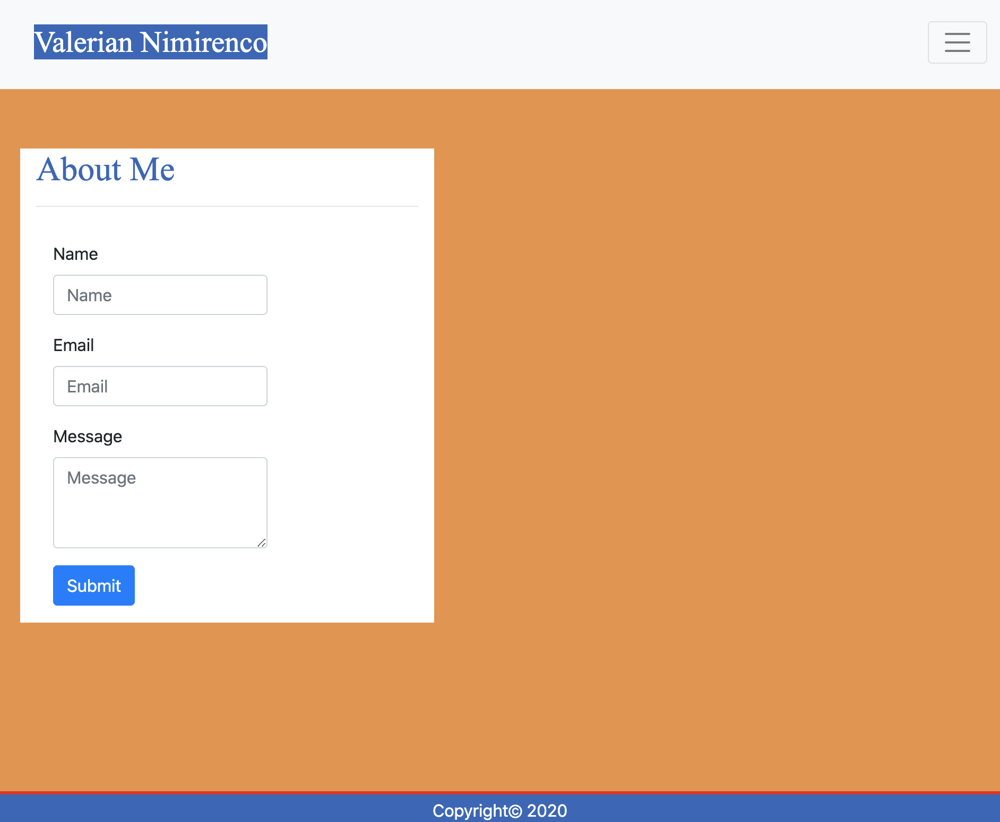
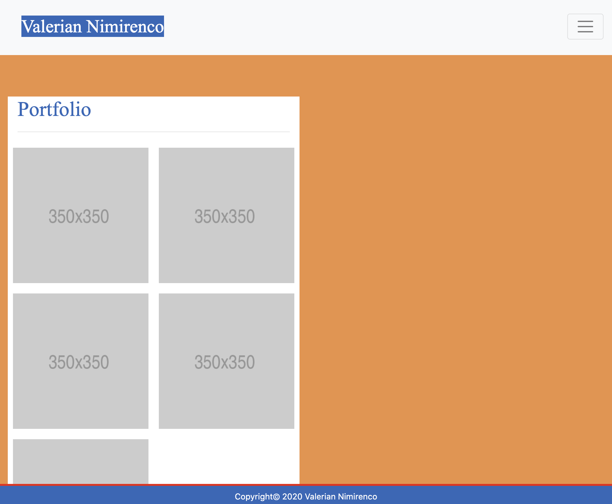

<!-- Heading -->
# Responsive Portfolio with Bootstrap 

## About the project
<p>This is my first professional responsive portfolio as a beginner full-stack developer. It is a great learning experience appling Bootstrap and it's components.</p>

___
### About Me
    
* _Responsive navbar_ 

### Contact
    
* _Responsive form_ 

### Portfolio
    
* _Responsive images_
---
### Tools used 
* Navbar component
    * Responsive navigation header
    * Collapsable navbar
    * Hidden navbar at lower screen sizes
    ```Responsive navbars consist of elements .navbar-expand{-sm|-md|-lg|-xl} for more info visit https://getbootstrap.com/```
<br>

* Layout
    * Containers
    * Breakpoins
    ```.containers set width to the content display they are basic elements used in this project.```
<br>

* Grid system
    * Rows
    * Columns
    ```Rows keep content aligned horizontaly,where columns are vertical```
<br>

* Utilities 
    * Spacing
    ```ex: mt-3 will space margin-top 3px where ml-5 will space margin-left 5px```
    

##### Credits
>* [Bootstrap](https://getbootstrap.com/)
>* [Google](https://www.google.com/)
>* [W3Schools](https://www.w3schools.com/)
>* [MDB](https://mdbootstrap.com/)
>* [Giphy](https://giphy.com/)

##### Contributors 

* valnimirenco@gmail.com
* [Val Nimirenco](https://github.com/valiant87)
* [Current Repository](https://valiant87.github.io/bootstrap-responsive-portfolio/index.html)
---
######Licences: **_none_**


